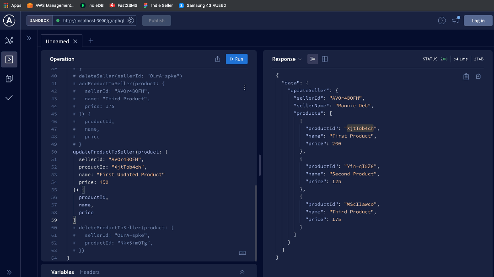

# graphQL-Ecom-Test

# Features :

- Create Seller.
- Update Seller.
- Delete Seller.
- Create Product
- Update Product
- Delete Product
- Get Seller
- Get Product

# DEMO VIDEO
<a href="https://youtu.be/OXIlv8b5HyM" title="AdaKerja Assignment Video Demo">
  <p align="center">
    
  </p>
</a>

# GIF SNIPPETS

## Create Seller

## Add Product

## Get Product

## Get Seller

## Update Seller

## Update Product

## Delete Product

## Delete Seller


# Runnig on Local Machine

```
npm install
```

```
npm run start
```

# Packages & Tech Used :

- Apollo Server Express
- Express
- Mongoose
- Shortid

```
Before starting initialise your env values in .env
```

```javascript
// Initialise .env
MONGO_DB_URI=YOUR_MONGO_CONNECT_URL
PORT=YOUR_PORT
```